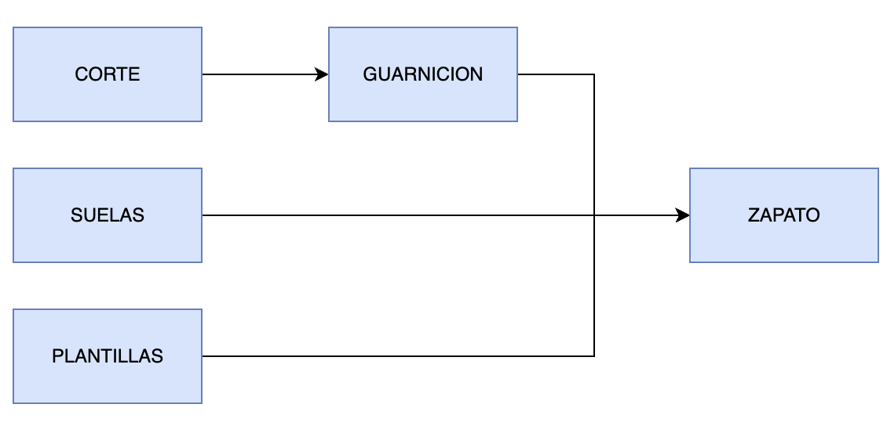

# simulacion 

Este repositorio contiene el codigo para realizar la simulacion del proceso de manufactura del calzado. Siguendo el siguiente esquema :




# instalcion y ejecucion

Para instalar los modulos necesarios ejecutar el siguiente comando

```
pip install -r requirements.txt
```


